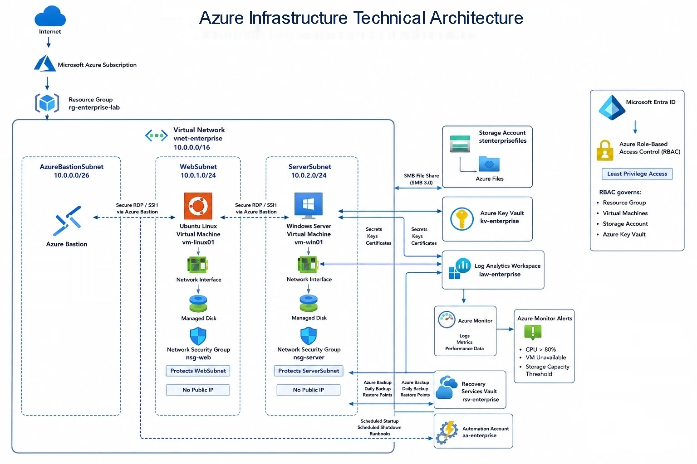

# Azure Enterprise Infrastructure




## Overview

This project demonstrates the deployment and management of a secure Microsoft Azure infrastructure environment following enterprise infrastructure and operations practices.

The environment was built to gain hands-on experience with Azure networking, security, virtual machines, storage services, backup, monitoring, and operational management.

## Project Objectives

* Design a secure Azure network architecture
* Implement network segmentation using subnets
* Configure Network Security Groups (NSGs)
* Deploy and manage Windows and Linux virtual machines
* Secure administrative access using Azure Bastion
* Implement Azure Files storage
* Configure backup and recovery services
* Enable monitoring and alerting
* Apply cost management and governance practices

## Architecture Overview

### Core Resources

| Resource                | Purpose                         |
| ----------------------- | ------------------------------- |
| Resource Group          | Centralized resource management |
| Virtual Network         | Private network environment     |
| Azure Bastion           | Secure VM administration        |
| Windows Virtual Machine | Windows server workload         |
| Linux Virtual Machine   | Linux server workload           |
| Network Security Groups | Network traffic control         |
| Storage Account         | Azure Files storage             |
| Recovery Services Vault | Backup and recovery             |
| Azure Monitor           | Monitoring and alerting         |

## Network Design

### Virtual Network

**Address Space:** `10.0.0.0/16`

### Subnets

| Subnet             | Address Range | Purpose              |
| ------------------ | ------------- | -------------------- |
| AzureBastionSubnet | 10.0.0.0/26   | Azure Bastion        |
| WebSubnet          | 10.0.1.0/24   | Application workload |
| ServerSubnet       | 10.0.2.0/24   | Backend servers      |

### Network Security

* Network Security Groups applied to workload subnets
* Controlled inbound and outbound traffic
* Private IP addressing for virtual machines
* Administrative access through Azure Bastion
* No direct RDP or SSH exposure to the internet

## Compute Infrastructure

### Windows Virtual Machine

* Windows Server 2022 Datacenter
* Private IP configuration
* Bastion-based administration
* Azure monitoring enabled
* Azure Backup enabled

### Linux Virtual Machine

* Linux server deployment
* Private IP configuration
* Bastion-based administration
* Azure monitoring enabled
* Azure Backup enabled

## Storage Implementation

### Azure Storage Account

Implemented Azure Files for centralized file storage and sharing.

Features:

* Azure Files
* SMB access
* Locally Redundant Storage (LRS)
* Windows connectivity
* Linux connectivity

## Backup and Recovery

### Recovery Services Vault

Backup protection configured for:

* Windows Virtual Machine
* Linux Virtual Machine

Backup capabilities:

* Scheduled backups
* Recovery point management
* Azure-managed backup storage
* Disaster recovery support

## Monitoring and Alerting

### Azure Monitor

Monitoring was configured to collect:

* CPU utilization
* Memory metrics
* Network activity
* Disk performance
* VM availability

### Alerts

Implemented alerting for:

* High CPU utilization
* Virtual machine availability
* Operational monitoring events

## Cost Management

Cost governance activities included:

* Resource usage review
* Cost analysis
* Budget awareness
* Service consumption monitoring

## Skills Demonstrated

### Microsoft Azure

* Azure Virtual Network
* Azure Bastion
* Azure Virtual Machines
* Network Security Groups
* Azure Storage Account
* Azure Files
* Recovery Services Vault
* Azure Backup
* Azure Monitor
* Azure Cost Management

### Infrastructure & Operations

* Infrastructure deployment
* Network segmentation
* Security hardening
* System administration
* Monitoring and alerting
* Backup and recovery
* Cloud governance

## Repository Structure

```text
docs/
├── architecture/
│   └── azure-architecture-diagram.jpg
│
└── screenshots/
    ├── 01-resource-group-created.png
    ├── 02-vnet-overview.png
    ├── ...
    └── 18-Final-overview.png
```

## Future Enhancements

Planned improvements include:

* Terraform deployment automation
* Bicep templates
* Azure Policy implementation
* Private Endpoints
* Azure Firewall
* Microsoft Defender for Cloud
* Hub-and-Spoke networking architecture
* CI/CD deployment pipeline

## Author

**Nabin Dhungana**

